# Newton_ikcable_notebook
franka_cube 파일을 압축을 풀면 다음과 같이 나온다
```
franka_cube/
├── README.md                # (원본은 Isaac Lab 확장 템플릿 안내문)
├── notebooks/
│   ├── 01_newton_ikcable_notebook.ipynb   ← 시작 지점 (Newton 단독)
│   ├── 02_isaaclab_newton...ipynb          ← 심화 (Isaac Lab 필요)
│   └── images/
├── scripts/                 # 강화학습(rsl_rl) 스크립트: train.py / play.py
└── source/franka_cube/      # Isaac Lab 확장 패키지 소스
```

현재는 GPU (NVDIA CUDA GPU)를 사용하지 않기에 02_isaaclab_newton...ipynb 해당 파일보다는 `01_newton_ikcable_notebook.ipynb`을 실행해본다.

## 일단 적어나가는 개념 (노트에 없는 내용 위주)

### • 1.1 CUDA
NVIDIA 그래픽 카드인 GPU를 이용해 계산을 빠르게 수행하는 기술
Newton과 갗은 물리 시뮬레이션처럼 같은 계산을 엄청 많이 반복하는 작업에 능함

### • 1.2 URDF
Unified Robot Description Format의 약자. 로봇의 몸 구조를 적어놓은 설계 설명서 파일이다.  

URDF의 파일 안에는 로봇에 대한 다음과 같은 정보가 들어간다
```
몸체가 몇 개, 관절이 어디 존재, 관절이 회전하는지 직선으로 움직이는지, 링크의 길이와 무게, 관절의 회전축, 충돌 현상, 화면에 표시할 3D 모델, 관절의 움직임 제한 
```

예를 들어 로봇팔을 단순히 표현하면 
```
바닥
 └── 관절 1
      └── 링크 1
           └── 관절 2
                └── 링크 2
```
이 연결 구조를 URDF 파일에 작성하는 것이다.   

URDF에서 가장 중요한 개념은 link와 joint 이다. 
- Link : 로봇의 움직이지 않는 하나의 단단한 부품 (로봇의 바닥, 그리퍼)
- joint : 두 링크를 연결하면서 움직임을 허용하는 부분 (회전 관절, 직선 이동 관절)

### • 1.3 XPBD (중요?)
Extended Position-Based Dynamics의 약자. 확장 위치 기반 동역학.  

일반적인 물리 시뮬레이션이 힘과 토크로 가속도를 계산한다면,  
XPBD는 계산된 위치가 관절 조건이나 충돌 조건을 위반하지 않도록 위치를 반복적으로 보정.  
쉽게 말하면 **관절(joint)** 이나 **접촉(contacts)** 같은 제약조건을 안정적으로 처리하는 **물리 solver 방식**

예를 들어 상자가 바닥에 뚫고 들어갔다면 XPBD가 접촉 조건을 만족하도록 상자를 바닥 위로 보정함.  

```
XPBD constraints
├─ Rigid body [물체 사이 제약이 중요]
│   ├─ Joint
│   │   ├─ Revolute
│   │   ├─ Prismatic
│   │   └─ Fixed
│   ├─ Joint limit
│   ├─ Contact / Collision
│   ├─ Friction
│   └─ 강체 사이의 위치·자세 관계 유지
│
└─ Deformable body [내부 변형 제약까지 중요]
    ├─ Stretch / Compression
    ├─ Shear
    ├─ Bending
    ├─ Twisting
    ├─ Volume preservation
    ├─ Contact
    └─ Self-contact / Self-collision
```


### • 1.4 역기구학(IK)
로봇팔의 끝부분 (End Effector)을 "여기로 보내고 싶다"고 했을 때 각 관절을 몇 도씩 움직여야 하는지 계산하는 것. 
```
목표:
로봇 손을 (x=0.5, y=0.2, z=0.4)에 놓아라
            ↓
           IK
            ↓
    Joint 1 = 20°
    Joint 2 = -35°
    Joint 3 = 15°
    ...
            ↓
로봇이 그 관절각을 따라 움직임
```
즉, 관절각 → 로봇 손 위치 (순기구학, FK) /  로봇 손 목표 위피 → 관절각 (역기구학, IK)


## 노트에 적힌 글 정리...?

- 핵심개념 : ModelBuilder → Model → State / Control → Solver  
└ **ModelBuiler** : USD, MJCF, URDF 형식의 에셋 불러오고, 강체·형상·관절과 각각의 속성을   조립하기 위한 모델 생성 API  
└ **Model** : 시뮬이 가능하게 변환된 데이터 (배열과 메타 데이터로 구성). CPU/GPU와 같은 연산 장치에 저장  
└ **State** : 시간에 따라 변하는 데이터 (ex. 위치, 속도, 힘)  
└ **Control** : joint에 전달하는 제어 입력 (ex. 목표 위치, 토크)  
└ **Contacts** : 충돌 감지 pipeline에서 생성되는 물체 간의 기하학적 접촉 정보  
└ **Solver** : 물리 법칙을 적분, 각종 제약 조건을 처리해 *시뮬을 다음 시점으로 진행*  

- 각 시뮬 substep *(한 번의 큰 시뮬 시간 간격을 더 잘게 나눈 계산 단위)* 에서 `Solver`는 `Model, State, Control, Contacts, dt (시간 간격)를 입력`으로 받아 `다음 시점의 State`를 계산. 
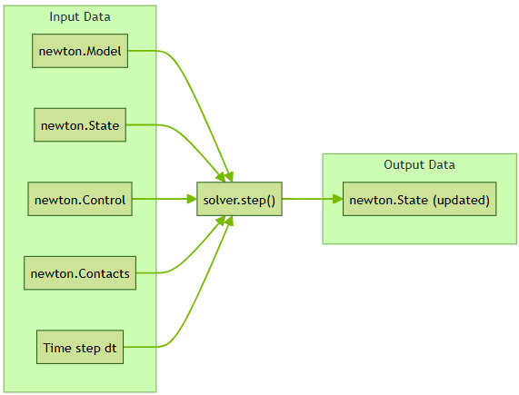
 


- 수치 계산에는 Wrap, 시뮬레이션에는 Newton을 사용  
└ **Warp** : CUDA 코드를 직접 작성하지 않아도 고성능 시뮬 및 기하 연산 코드를 작성 가능하도록 NVIDIA가 만든 Ptyhon 프레임워크. Warp가 CPU에 최족화된 네이티브 코드로 변환해주어, Python의 편리한 개발 방식을 유지하면서도, 물리 시뮬·로보틱스·그래픽스 작업에서 저수준 언어에 가까운 높은 성능을 얻을 수 있음.
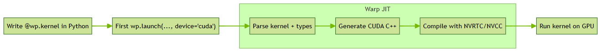

- **finalize()** : 다음의 함수를 수행하면 ModelBuilder가 연산 장치에서 바로 사용 가능한 Model로 변환된다. 


- **성능 최적화 : CUDA 그래프 캡쳐**  
GPU에서 작은 커널을 여러 번 반복 실행 시, 실제 계산 시간보다 각 커널을 실행하도록 요청하는 오버헤드가 전체 실행 시간에서 큰 비중 차지.  
이러한 오버헤드 줄이기 위해 **CUDA 그래프 캡쳐**를 Warp가 지원.  
simulate() 반복문을 한 번 그래프로 캡쳐한 뒤, 캡쳐된 그래프를 반복해 재사용 하는 방식.
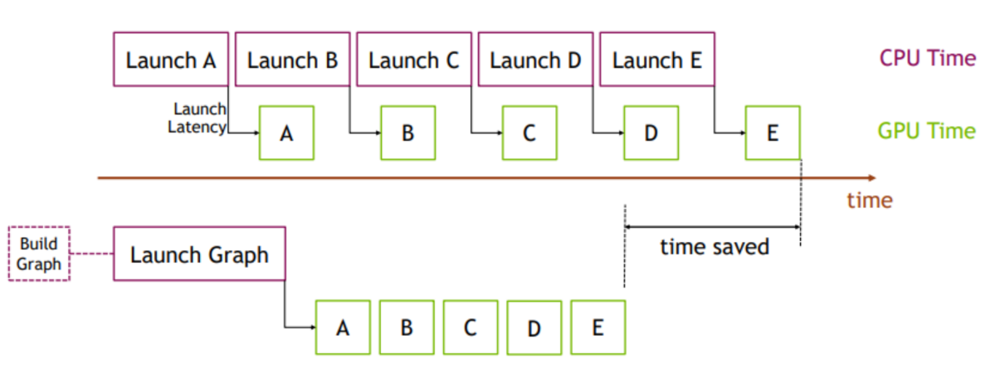  
해당 그림의 위의 방법은 CUDA 그래프를 사용하지 않는 일반적인 실행 방식이다. CPU가 GPU 커널 A부터 E까지 각각 따로 실행 요청을 보내고 그에 따른 지연시간(Launch Latency)가 발생하는 것을 확인.  
아래의 방법은 CUDA 그래프를 사용하는 방식이다. 처음에 A → B → C → D → E 작업 순서를 하나의 그래프로 구성한 다음, 그래프 전체를 한 번만 실행 요청한다. CPU의 반복 호출 오버헤드를 줄이고, time을 save한 것을 확인 가능. 

- URDF로 로봇을 불러오고, `Control.joint_target_pos`를 이용해 관절에 목표 각도를 준다

- **Newton의 역기구학(IK)** `Inverse Kinematics (IK) in Newton`  
└ Newton의 IK 모듈인 `newton.ik`는 Warp 기반 구축된 **배치형 역기구학 시스템**이다.  
└ Newton이 단순히 물리 시뮬레이션만 하는 것이 아닌 IK를 계산하기 위한 자체 모듈도 제공한다는 뜻.
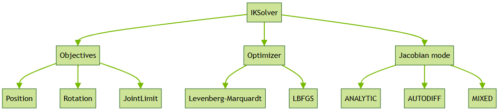
 **Obectives** : IK가 “무엇을 만족해야 하는가”  
 └ Position → 로봇 손을 목표 위치로 보내기  
 └ Rotation → 로봇 손의 방향/자세 맞추기  
 └ JointLimit → 관절이 허용 범위를 넘어가지 않게 하기  
**Optimizer** : 그 목표를 만족하는 관절각을 어떤 최적화 방법으로 찾을 것인가  
**Jacobian mode** : 관절을 조금 움직였을 때 로봇 손이 얼마나 움직이는지를 나타내는 Jacobian을 어떻게 계산할 것인가  
└ ANALYTIC(수식), AUTODIFF(자동미분), MIXED(둘을 섞어서 사용)


## 노트에 적힌 셀 정리...?

### 0) setup
 1
: Newton이 MuJoCo 솔버를 사용할 수 있도록 MuJoCo 관련 라이브러리를 불러와 내부에 저장해 두는 준비 작업

 2 
: CPU 사용 여부 선택, ViewerViser 생성 도구, Mermaid 흐름도(다이어그램) 출력 도구, 노트북용 진행률 표시줄 생성

###  1) ModelBuilder -> Model

 3, 4
: 개념에 해당하는 사진 출력

 5 
: Newton 시뮬 장면의 설계도(ModelBuilder)에 바닥 1개, 떨어질 수 있는 박스 1개, 구 1개를 추가하고 생성된 물체 수를 확인. 
```  
Bodies: 2 -> 움직이는 박스와 구 /  Shapes: 3 -> 바닥, 박스 모양, 구 모양
```

 6 
 : *5*에서 만든 설계도를 실제 시뮬 Model로 확정. 이 Model 기반으로 `state` `control` `contacts` 객체 생성. 초기 장면을 ViewerViser에 표시.
```
state 2개 -> 현재 상태(state_0), 다음 상태(state_1)
control 1개 -> 제어 입력값
contacts 1개 -> 각 substep마다 충돌 감지 pipeline이 계산한 접촉 정보 저장

Contacts는 현재 상태인 State, 제어 입력인 Control, 시간 간격인 dt와 함께 solver.step(...)에 전달.
```
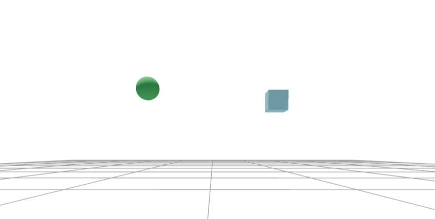

---

### 2) Solver and Simulation Loop
7 
: XPBD의 solver 설정. 화면의 1프레임(1/60초)을 8개의 작은 substep으로 나누어 충돌 계산과 물리 업데이트를 반복하는 시뮬.

```
시뮬 반복문의 기본 흐름
1. 힘(force) 초기화
    - 이전 substep에 남아있는 힘을 초기화
2. 충돌 검사
    - 물체 간 충돌과 접촉 정보를 계산
3. 시뮬레이션 한 단계 진행 => solver.step()
    - solver가 위치와 속도를 다음 시점으로 계산
4. state 버퍼 교체
    - 현재 상태(state)와 다음 상태 버퍼의 역할을 서로 교체
```

 8 
: 시뮬레이션을 180프레임 동안 실행. 매 프레임의 물체 상태를 ViewerViser에 기록한 뒤, 마지막에 3초 분량의 재생화면을 노트북에 표시.  
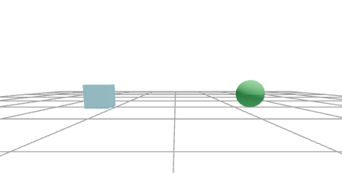

---

### 3) Performance : CUDA Graph Capture
현재 본인이 GPU의 환경이 아닌 CPU-only 환경에서 작성하기 때문에 관점을 2개로 나누어 작성한다. 

| 셀 | GPU환경 | CPU-only환경 |
|---|---|---|
| 9 | simulate()를 CUDA Graph로 캡처한 뒤 그 그래프를 120번 재생 | CUDA Graph 캡처를 건너뛰고 simulate()를 그냥 120번 실행 |
| 10 | CUDA Graph 없이 simulate()를 120번 직접 실행한 시간 측정 | CPU에서 simulate()를 120번 실행한 시간 측정 |
| 11 | 1번에서 만든 CUDA Graph를 120번 재생한 시간 측정 | graph=None이라 실행 불가 → 오류 |

CUDA Graph Capture 방식에 대하여 일반 실행과 Graph Capture 실행의 성능을 비교하는 과정이다. 

---

### 4) Load Robot

URDF 파일에서 Franka 로봇팔을 불러온다. (Model 생성)  
로봇의 운동학적 상태(kinematic state)를 초기화하고 *(각 관절의 초기값, joint_q를 기준으로 각 링크의 위치, 자세 계산해 로봇이 초기 자세를 가지게 된다. 여기서 초기 자세는 state_0에 반영된다)*,   
관절 목표값 제어로 넘어가기 전 현재 시뮬 장면이 올바른지 확인한다. 
```
GitPython과 pycollada 패키지가 없어서 오류 발생. 

source ~/newton-env/bin/activate
로 (newton-env)를 활성화 시키고 

pip install GitPython
pip install pycollada

설치가 완료되면, jupyter lab이 실행되는 터미널에서 Ctrl+C로 종료 후, 
다시 jupyter lab에 연결해서 맨 위의 셀부터 다시 실행하면 오류가 해결된다. 
```

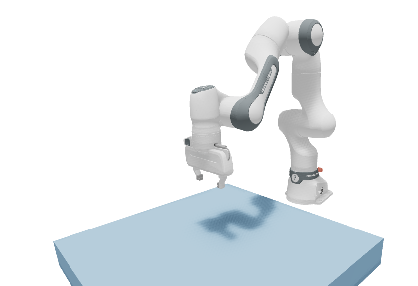

---

### 5) Joint Targets with Control.joint_target_pos

대부분의 로봇 제어기는 target position(목표 관절 위치)와 함께 PD gain을 사용해 관절을 구동한다.  

Franka 로봇에 PD 기반 joint target 제어를 설정하고, `Control.joint_target_pos`를 통해 특정 관절에 사인파 형태의 목표 위치를 입력하여 MuJoCo Solver로 3초간 움직임을 시뮬레이션한다.

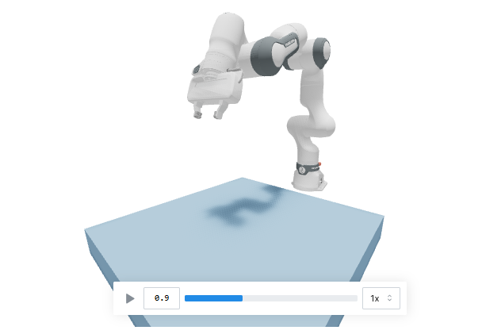

---

### 6) IK Path Following

모든 IK 계산에서는 관절 제한(joint limits)을 계속 활성화한다. 또한 각 IK 구성 요소가 코드의 어느 부분에서 사용되었는지 쉽게 확인할 수 있도록 작성되어 있음. 

#### Step 1 : 하나의 목표에 대한 위치 전용 IK
Franka의 End Effector를 현재 위치에서 [0, +0.52, +0.04]만큼 이동한 고정된 엔드이펙터 위치 목표를 설정한다.   
목표 위치로 보내기 위해 Newton IK를 풀고, 계산된 관절각을 `Control.joint_target_pos`에 넣어 MuJoCo로 120프레임 동안 실제 움직임을 시뮬레이션한다. 

쉽게 설명하면 목표점 하나에 EE(End Effector)를 보낸다. 

```
<코드의 흐름>
Franka 로봇만 있는 장면 생성
            ↓
End Effector의 현재 위치 확인
            ↓
목표 위치 설정
현재 위치 + [0, 0.52, 0.04]
            ↓
IK Objective 설정
• Position Objective → End Effector가 목표 위치에 도달하도록 설정
• JointLimit Objective → 관절 제한 범위를 벗어나지 않도록 설정
            ↓
IKSolver 실행
• Jacobian = ANALYTIC
• 반복 계산을 통해 목표 위치를 만족하는 관절각 계산
            ↓
계산된 Franka 7개 관절의 목표값
            ↓
Control.joint_target_pos에 전달
            ↓
MuJoCo Solver
목표 관절값을 따라 실제 로봇의 움직임을 물리적으로 계산
            ↓
State 업데이트
            ↓
ViewerViser
End Effector의 움직임과 이동 궤적을 기록·표시
```
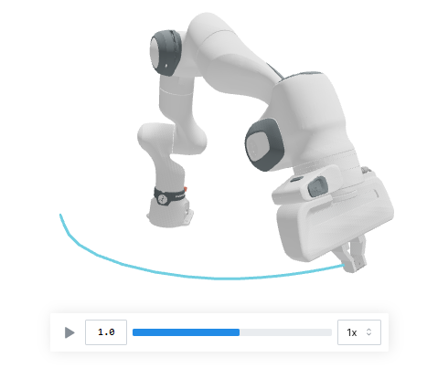

#### Step 2: Preview the Rectangle Path (No IK Yet)
Franka의 End Effector 현재 위치를 기준으로 앞쪽에 작은 사각형 경로를 하나 정의하고, 실제 IK나 로봇 움직임 계산은 하지 않은 채 ViewerViser에 그 사각형 경로만 미리 표시하는 코드

즉, 앞으로 따라갈 사각형 경로 모양만 확인하는 코드

```
<코드의 흐름>
Franka 로봇 장면 생성
        ↓
초기 FK 계산
        ↓
End Effector 현재 위치 확인
        ↓
현재 위치에서 y 방향으로 +0.25 이동한 지점을
사각형 중심으로 설정
        ↓
±0.08을 이용해 사각형의 네 꼭짓점 생성
        ↓
꼭짓점들을 서로 연결
        ↓
ViewerViser에
Franka 초기 자세 + 사각형 경로 표시
```
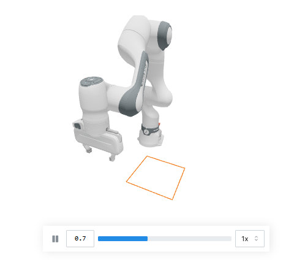


#### Step 3: Full Rectangle IK Tracking
Franka End Effector가 사각형 경로를 따라가도록 각 경로점마다 IK를 계산하고, 계산된 관절각을 Control.joint_target_pos에 넣어 MuJoCo로 실제 움직임을 시뮬레이션하면서 목표 경로와 실제 이동 궤적을 ViewerViser에 함께 표시하는 코드

```
<코드의 흐름>
Franka 로봇 장면 생성
            ↓
End Effector 초기 위치 계산
            ↓
초기 위치 기준으로 사각형 경로 설정
• 한 변 = 0.16 m
• 각 변을 45개 프레임으로 분할
→ 총 180개 목표 위치
            ↓
IK Objective 설정
• Position → 현재 사각형 경로점에 도달
• Rotation → End Effector 방향을 일정하게 유지
• JointLimit → 관절 제한 준수
            ↓
각 경로점마다 IKSolver 실행
• Jacobian = ANALYTIC
• 24회 반복하여 관절각 계산
            ↓
계산된 7개 관절각을
Control.joint_target_pos에 입력
            ↓
MuJoCo Solver로 실제 Franka 움직임 계산
            ↓
다음 사각형 경로점으로 이동
            ↓           
반복
            ↓
ViewerViser에 표시
• 주황색: 목표 사각형 경로
• 하늘색: 실제 End Effector 이동 궤적
```

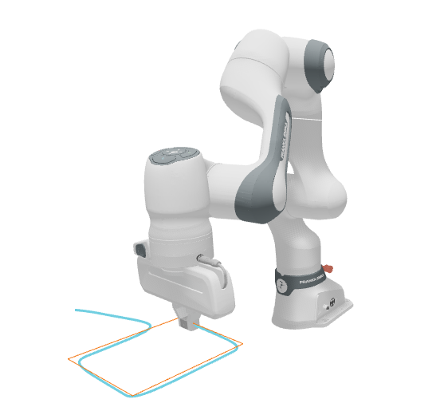

## Coupled Manipulation : Franka Cable Pick-and-Place
> 해당 내용은 원래 6) IK Path Following의 다음 내용이지만 deformable body에 대해 다루기 때문에 중요하다고 생각해 따로 뺌. 

6)과 동일히 IK 패턴을 사용하지만, **변형 가능한 케이블을 집어서 목표 위치로 옮기는 작업** (1개 이상의 Solver가 필요)에 대해 다룬다.

### 왜 Coupling이 필요한가?
Franka 로봇팔 → Rigid Body  | 변형 가능한 케이블 → Deformable Body  
따라서 서로 다른 수치해석 방식이 필요하다. 

Newton의 **coupled-solver framework**를 사용하면  
각 부분에 적합한 solver를 시용하면서도 두 시스템이 서로 상호작용 하도록 연결 가능하다.

해당 예제에서는 케이블을 **여러 segment로 이루어진 rod 형태의 변형체**로 모델링 한다. (=케이블을 여러 개의 짧은 구간으로 나누고, 각 구간 사이의 늘어남, 굽힘, 비틀림 등을 계산해 전체 케이블의 변형을 표현)

#### • 이 코드 블록의 목적
Franka + deformable cable을 결합 시뮬레이션하기 위해 사용할 solver와 초기 파라미터들을 준비하는 셸

```
<전체 구조>
Franka (강체 articulated robot)
        ↓
SolverMuJoCo : Franka의 관절 구조와 joint target을 처리
------------------------------------------------------------------
Cable (변형 가능한 rod)
        ↓
SolverVBD : 막대(rod) 형태로 표현된 변형 가능한 케이블을 처리
------------------------------------------------------------------
Franka ↔ Cable
        ↓
SolverCoupled / SolverCoupledProxy
: MuJoCo 쪽의 일부 gripper body를 VBD 쪽의 proxy body로 전달
이를 통해 Franka 자체는 MuJoCo가 계산하면서도, 케이블은 gripper와 접촉 가능
-------------------------------------------------------------------

gripper body : 로봇 그리퍼를 구성하는 Rigid Body. 
               ex. Franka 손끝의 왼쪽/오른쪽 finger 같은 링크

VBD : Vertex Block Descent. 
      Newtone의 SolverVBD는 deformable, 특히 particle/soft body를 
      계산 가능한 implicit solver이다. 
      케이블 예제에서는 케이블의 '늘어남, 굽힘, 접촉 가튼 변형 거동'을 계산

      SolverVBD는 particle에는 VBD, rigid body에는 AVBD를 사용. 

proxy body : 다른 solver 안에 실제 그리퍼를 대신 보여주는 '대리 강체'

             MuJoCo는 강체(Franka)의 위치를 계산하고 VBD는 케이블의 위치/변형을 계산한다. 
             이 둘은 별도의 solver 이다. 
             케이블의 입장에서는 "그리퍼가 어디있는지, 나랑 부딫혔는지"를 알아야한다.
             따라서 MuJoCo가 관리하는 실제 gripper body 일부를 VBD 쪽에 
             "Proxy Body"로서 노출시키는 것이다. 

```